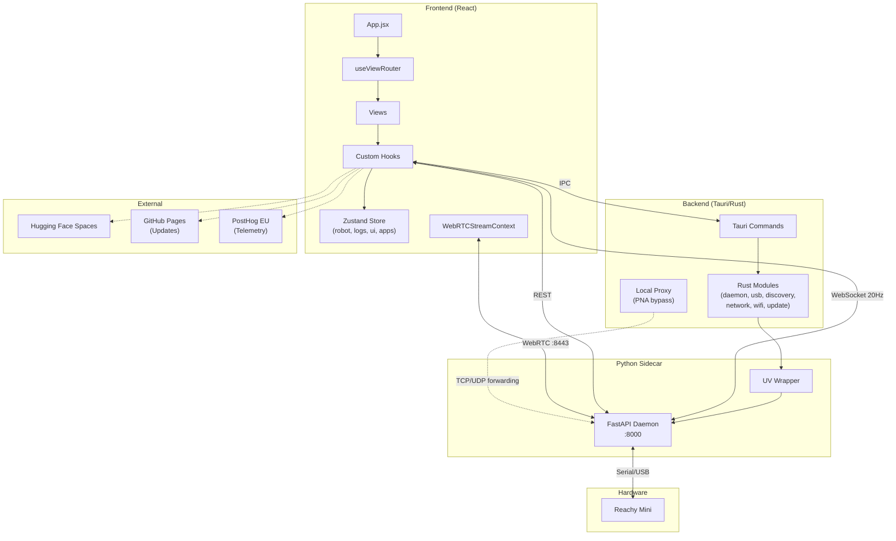
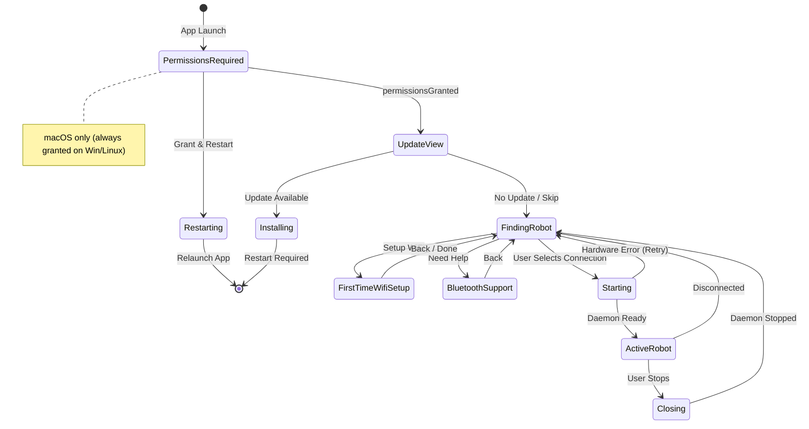

<div align="center">
  <a href="https://huggingface.co/spaces?q=reachy_mini">
    
  </a>
  
  <h1>Reachy Mini Control</h1>
  
  <p>
    
    
    
    
  </p>
</div>

A modern desktop application for controlling and monitoring your Reachy Mini robot. Built with Tauri and React for a native, performant experience.

> **📢 Platform Support**  
> ✅ **macOS** - Fully supported and production-ready  
> 🚧 **Windows & Linux** - Work in progress, not yet ready for production use

This desktop application provides a unified interface to manage your Reachy Mini robot. It handles the robot daemon lifecycle, offers real-time 3D visualization of the robot's state, and includes an integrated app store to discover and install applications from Hugging Face Spaces. The app automatically detects USB-connected robots and provides direct access to audio controls, camera feeds, and robot choreographies.

## ✨ Features

- 🤖 **Robot Control** - Start, stop, and monitor your Reachy Mini daemon
- 📊 **Real-time 3D Visualization** - Live robot state via WebSocket at 20Hz with URDF model, X-ray effects, smooth mount-flash-free loading (opaque spinner hides the default pose until the first real frame is applied)
- 🏪 **Application Store** - Discover, install, and manage apps from Hugging Face Spaces
  - Browse official and community apps
  - Search and filter by categories
  - One-click installation and removal via deep links or UI
  - Start and stop apps directly from the interface
- 📚 **Create Your Own Apps** - Tutorials and guides to build custom applications
- 📹 **Camera & Audio** - Live WebRTC camera feed with Direction of Arrival (DoA) audio visualization
- 🎮 **Robot Controller** - 2D joystick and sliders for real-time robot position control
- 🔄 **Auto Updates** - Seamless automatic updates with progress tracking
- 🎨 **Modern UI** - Clean, intuitive interface built with Material-UI and Framer Motion
- 🔌 **USB Detection** - Automatic detection of Reachy Mini via USB
- 📶 **WiFi Discovery** - mDNS-based robot discovery with local proxy for Private Network Access
- 🖥️ **Multi-window** - Synchronized state across Tauri windows
- 📊 **Anonymous Telemetry** - Opt-in usage analytics via PostHog EU (see [Telemetry docs](./docs/TELEMETRY.md))
- 📱 **Cross-platform** - Works on macOS, Windows, and Linux

## 🚀 Quick Start

### Prerequisites

- **Node.js 24.4.0+** (LTS recommended) and Yarn
  - If using `nvm`: `nvm install --lts && nvm use --lts`
- Rust (latest stable)
- System dependencies for Tauri ([see Tauri docs](https://v2.tauri.app/start/prerequisites/))
  - **Linux users**: See [Linux Setup Guide](./docs/LINUX_SETUP.md) for detailed installation instructions

### Installation

```bash
# Clone the repository
git clone https://github.com/pollen-robotics/reachy-mini-desktop-app.git
cd reachy-mini-desktop-app/reachy_mini_desktop_app

# Install dependencies
yarn install

# Run in development mode
yarn tauri:dev
```

```bash
# Check your Node version
node --version

# If using nvm, install and use the latest LTS
nvm install --lts
nvm use --lts
nvm alias default $(nvm version)  # Set as default
```

### Building

**Important**: You must build the sidecar before building the application.

```bash
# 1. Build the sidecar (required first step)
yarn build:sidecar-macos    # macOS
yarn build:sidecar-linux    # Linux
yarn build:sidecar-windows  # Windows

# 2. Build the application
yarn tauri:build            # Build for production (uses PyPI release by default)

# Build for specific platform
yarn tauri build --target aarch64-apple-darwin
yarn tauri build --target x86_64-apple-darwin
yarn tauri build --target x86_64-pc-windows-msvc
yarn tauri build --target x86_64-unknown-linux-gnu
```

#### Installing the daemon from different sources

By default, the `reachy-mini` package is installed from PyPI (latest stable release). You can also install from any GitHub branch by using the `REACHY_MINI_SOURCE` environment variable:

- **PyPI (default)** : `REACHY_MINI_SOURCE=pypi` or omit the variable
- **GitHub branch** : `REACHY_MINI_SOURCE=<branch-name>` (e.g., `develop`, `main`, `feature/xyz`)

Examples to build the sidecar with different sources:
```bash
# macOS - Build with a specific branch
REACHY_MINI_SOURCE=develop bash ./scripts/build/build-sidecar-unix.sh
REACHY_MINI_SOURCE=main bash ./scripts/build/build-sidecar-unix.sh
REACHY_MINI_SOURCE=feature/my-feature bash ./scripts/build/build-sidecar-unix.sh

# Linux - Uses PyInstaller pipeline
REACHY_MINI_SOURCE=develop bash ./scripts/build/build-daemon-pyinstaller.sh
```

> **Note**: macOS uses `build-sidecar-unix.sh` while Linux uses `build-daemon-pyinstaller.sh` for packaging. See [PyInstaller README](./scripts/build/README_PYINSTALLER.md) for details on the Linux pipeline.

## 📖 Documentation

### Guides

- [Linux Setup Guide](./docs/LINUX_SETUP.md) - Linux installation and configuration
- [Linux Packaging Strategy](./docs/LINUX_PACKAGING_STRATEGY.md) - Linux distribution strategy and solutions
- [Scripts Directory](./scripts/README.md) - Organization and usage of build scripts
- [Code Signing](./docs/CODE_SIGNING_REPORT.md) - macOS and Windows code signing documentation
- [Update System](./docs/README.md) - Auto-updater and GitHub Pages deployment
- [Technical Context](./CONTEXT.md) - Hardware specs, streaming, and technical reference
- [Kinematics WASM](./kinematics-wasm/README.md) - WebAssembly kinematics module
- [Telemetry](./docs/TELEMETRY.md) - Anonymous analytics events and opt-out
- [Key Rotation](./KEY_ROTATION.md) - Code signing key rotation procedures
- [Avast SSL Fix](./docs/AVAST_SSL_FIX.md) - Fix for Avast Antivirus SSL issues on Windows
- [E2E Tests](./e2e/README.md) - End-to-end testing with WebdriverIO

### Application Store

The application includes a built-in store for discovering and installing apps:

- **Discover Apps**: Browse apps from Hugging Face Spaces tagged with `reachy_mini`
- **Install & Manage**: Install, uninstall, start, and stop apps with a simple interface
- **Search & Filter**: Find apps by name or filter by categories
- **Deep Links**: Install apps directly via `reachymini://` deep links
- **Create Apps**: Access tutorials to learn how to build your own Reachy Mini applications

Apps are managed through the FastAPI daemon API, which handles installation and execution.

### Running Modes

| Mode | Entry Point | Description |
|------|-------------|-------------|
| **Desktop (Tauri)** | `App.tsx` | Full desktop app with native features (USB, daemon management, updates) |
| **Web Dashboard** | `WebApp.tsx` | Standalone web version for daemon control (build with `yarn build:web`) |
| **Dev Playground** | `DevPlayground.tsx` | Component playground accessible at `/#dev` in development mode |

## 🛠️ Development

### Available Scripts

**Development:**
```bash
yarn dev                    # Start Vite dev server only
yarn tauri:dev              # Run Tauri app in dev mode
yarn tauri:dev:fresh        # Kill daemon, clean, rebuild sidecar, then dev
```

**Building:**
```bash
# Build sidecar (required before tauri:build)
yarn build:sidecar-macos              # macOS (PyPI, uses build-sidecar-unix.sh)
yarn build:sidecar-linux              # Linux (PyPI, uses build-daemon-pyinstaller.sh)
yarn build:sidecar-windows            # Windows (PyPI)

# Build sidecar with specific branch
yarn build:sidecar-macos:develop      # macOS with develop branch
yarn build:sidecar-linux:develop      # Linux with develop branch
yarn build:sidecar-macos:main         # macOS with main branch
yarn build:sidecar-linux:main         # Linux with main branch
yarn build:sidecar:branch             # Interactive branch selection

# Build application
yarn tauri:build                      # Build production bundle

# Build web dashboard (for daemon)
yarn build:web                        # Build web version
yarn deploy:daemon-v2                 # Deploy to daemon dashboard
```

**Updates:**
```bash
yarn build:update:dev       # Build update files for local testing
yarn build:update:prod      # Build update files for production
yarn serve:updates          # Serve updates locally for testing
```

**Testing:**
```bash
yarn test:sidecar           # Test the sidecar build
yarn test:app               # Test the complete application
yarn test:updater           # Test the update system
yarn test:update-prod       # Test production updates
yarn test:all               # Run sidecar + app + updater tests (excludes update-prod)
yarn test:e2e               # Run end-to-end tests with WebdriverIO
```

**Code Quality:**
```bash
yarn lint                   # Run ESLint on src/
yarn lint:fix               # Run ESLint with auto-fix
yarn format                 # Format all files with Prettier
yarn format:check           # Check formatting without writing
```

**Utilities:**
```bash
yarn check-daemon           # Check daemon status and health
yarn kill-daemon            # Stop all running daemon processes
yarn kill-zombie-apps       # Kill zombie app processes
yarn reset-permissions      # Reset macOS permissions (dev)
yarn clean                  # Clean build artifacts
```

### 🔧 Debugging & Diagnostics

**Diagnostic Export (Secret Shortcut):**

Press `Cmd+Shift+D` (Mac) or `Ctrl+Shift+D` (Windows/Linux) anywhere in the app to download a complete diagnostic report. This generates a `.txt` file containing:

- System info (OS, app version, screen size, etc.)
- Robot state (connection mode, status, daemon version, errors)
- Installed apps list
- All frontend logs (last 500)
- All daemon logs
- All app logs (last 500)

**DevTools Access:**
```javascript
// In browser console
window.reachyDiagnostic.download()      // Download as JSON
window.reachyDiagnostic.downloadText()  // Download as readable TXT
window.reachyDiagnostic.copy()          // Copy JSON to clipboard
window.reachyDiagnostic.generate()      // Get report object
```

This is useful for:
- Bug reports and support tickets
- Debugging connection issues
- Analyzing app crashes
- Sharing logs with the development team

### Project Structure

```
reachy_mini_desktop_app/
├── src/                              # Frontend React code (fully TypeScript)
│   ├── main.tsx                     # Vite entry point (bootstraps App/WebApp)
│   ├── components/                   # Reusable React components
│   │   ├── viewer3d/                # 3D robot visualization (README.md)
│   │   │                            #   - Viewer3D + Scene + URDFRobot
│   │   │                            #   - components/ (LoadingSpinner, StatusTag, SettingsButton)
│   │   │                            #   - hooks/ (useRobotWebSocket, useCoalescedRobotState)
│   │   │                            #   - effects/ (Scan, PremiumScan, ErrorHighlight, Particles)
│   │   │                            #   - settings/ (cards for the settings panel)
│   │   ├── emoji-grid/              # Emotion wheel and emoji display
│   │   ├── camera/                  # Camera components (standalone CameraStream)
│   │   ├── LogConsole/              # Log console (Simple/Dev toggle, virtualized list)
│   │   ├── Toast/                   # Toast notifications
│   │   ├── wifi/                    # WiFi configuration components
│   │   ├── ui/                      # Generic UI primitives (StepsProgressIndicator, ...)
│   │   ├── App.tsx                  # Main Tauri application entry
│   │   ├── WebApp.tsx               # Web-only entry (daemon dashboard v2)
│   │   ├── DevPlayground.tsx        # Development playground (/#dev)
│   │   ├── AppTopBar.tsx            # Top bar with controls
│   │   ├── FullscreenOverlay.tsx    # Fullscreen overlay component
│   │   ├── ReachiesCarousel.tsx     # Robot carousel display
│   │   ├── ErrorBoundary.tsx        # Top-level React error boundary
│   │   ├── PulseButton.tsx          # Animated pulse button
│   │   └── FPSMeter.tsx             # Performance monitor
│   ├── hooks/                        # Custom React hooks (organized by domain)
│   │   ├── audio/                   # Audio hooks (useDoA)
│   │   ├── auth/                    # Hugging Face auth hooks (useHfAuth)
│   │   ├── bluetooth/               # Bluetooth hooks (useBluetooth)
│   │   ├── daemon/                  # Daemon lifecycle hooks
│   │   │   ├── useDaemon.ts               # Start/stop daemon
│   │   │   ├── useDaemonLifecycle.ts      # Lifecycle orchestration
│   │   │   ├── useDaemonHealthCheck.ts    # Health monitoring
│   │   │   ├── useDaemonEventBus.ts       # Event bus for daemon events
│   │   │   ├── useDaemonReconciliation.ts # Reconciliation with daemon state
│   │   │   ├── useStartupStages.ts        # Startup stage tracking
│   │   │   └── useDaemonStartupLogs.ts    # Daemon startup log streaming
│   │   ├── media/                   # Media hooks
│   │   │   ├── useAudioAnalyser.ts  # Audio analysis
│   │   │   └── useWebRTCStream.ts   # WebRTC streaming
│   │   ├── robot/                   # Robot state hooks
│   │   │   ├── useRobotStateWebSocket.ts  # Centralized WebSocket streaming (20Hz)
│   │   │   ├── useRobotCommands.ts        # Robot command execution
│   │   │   └── useActiveMoves.ts          # Active moves tracking
│   │   ├── system/                  # System hooks
│   │   │   ├── useViewRouter.tsx         # View state machine (priority-based routing)
│   │   │   ├── useUpdater.ts             # Auto-update management
│   │   │   ├── useUsbDetection.ts        # USB robot detection
│   │   │   ├── usePermissions.ts         # macOS permissions
│   │   │   ├── useRobotDiscovery.ts      # Robot discovery (WiFi/mDNS)
│   │   │   ├── useLocalWifiScan.ts       # Local WiFi network scanning
│   │   │   ├── useDeepLink.ts            # Deep link handling (reachymini://)
│   │   │   ├── useUpdateViewState.ts     # Update view state management
│   │   │   ├── useWindowResize.ts        # Window resize handling
│   │   │   ├── useWindowVisible.ts       # Window visibility tracking
│   │   │   ├── useUsbCheckTiming.ts      # USB check timing logic
│   │   │   └── useLogs.ts                # Log management
│   │   ├── adapters/                # Typed shapes for the ActiveRobot context
│   │   ├── useConnection.ts         # Connection mode management (USB/WiFi/Simulation)
│   │   ├── useActiveRobotAdapter.ts # Adapter for ActiveRobot context (Tauri)
│   │   ├── useWebActiveRobotAdapter.ts # Adapter for ActiveRobot context (Web)
│   │   ├── useDaemonLogStream.ts    # Pipe daemon logs into the store
│   │   ├── useLogViewerBridge.ts    # Bridge for the log viewer window
│   │   ├── useToast.ts              # Toast notification hook
│   │   └── useResizeObserver.ts     # Element resize observer
│   ├── views/                        # Main application views
│   │   ├── update/                  # Update checking view
│   │   ├── permissions-required/    # Permissions view (macOS)
│   │   ├── finding-robot/           # Connection selection view
│   │   ├── first-time-wifi-setup/   # WiFi setup wizard (5 steps)
│   │   ├── bluetooth-support/       # Bluetooth help view
│   │   ├── starting/                # Hardware scan view (3D animation)
│   │   ├── closing/                 # Shutdown view
│   │   ├── log-viewer/              # Standalone log viewer window
│   │   ├── windows/                 # Multi-window sync (useWindowSync, useWindowFocus)
│   │   └── active-robot/            # Active robot view
│   │       ├── ActiveRobotView.tsx      # Main view
│   │       ├── ActiveRobotModule.tsx    # Providers + adapters wiring
│   │       ├── RobotHeader.tsx          # Top header
│   │       ├── application-store/       # App store (README.md)
│   │       ├── controller/              # Robot controller (README.md)
│   │       ├── audio/                   # Audio controls & DoA indicator
│   │       ├── camera/                  # Camera feed (WebRTC via context)
│   │       ├── right-panel/             # Right panel (expressions, controller, apps)
│   │       ├── controls/                # Power & sleep buttons
│   │       ├── layout/                  # ViewportSwapper (3D <-> camera toggle)
│   │       ├── context/                 # ActiveRobotContext
│   │       └── hooks/                   # View-specific hooks (wake/sleep, power state)
│   ├── contexts/                     # React contexts
│   │   └── WebRTCStreamContext.tsx  # Shared WebRTC stream (avoids duplicate connections)
│   ├── store/                        # State management (Zustand)
│   │   ├── slices/                  # Store slices (apps, logs, robot, ui, ...)
│   │   ├── middleware/              # Store middleware (windowSync across Tauri windows)
│   │   ├── useStore.ts              # Main unified store
│   │   ├── useAppStore.ts           # Alias for useStore (backward compat)
│   │   └── storeLogger.ts           # Store debug logger
│   ├── types/                        # Shared TypeScript types (robot, store, api, ...)
│   ├── utils/                        # Utility functions
│   │   ├── telemetry/               # PostHog analytics integration
│   │   ├── kinematics-wasm/         # WASM bindings for passive joints
│   │   ├── logging/                 # Logging utilities
│   │   ├── viewer3d/                # 3D viewer helpers (materials, findErrorMeshes, ...)
│   │   ├── robotModelCache.ts       # URDF model caching
│   │   ├── diagnosticExport.ts      # Diagnostic report generation
│   │   ├── hardwareErrors.ts        # Hardware error metadata & mesh resolution
│   │   ├── scanParts.ts             # Mesh -> scan part mapping
│   │   ├── arraysEqual.ts           # Tolerance-based array comparison
│   │   └── simulationMode.ts        # Simulation mode utilities
│   ├── config/                       # Centralized configuration (daemon URLs, timeouts)
│   └── constants/                    # Shared constants (WiFi, robot status, choreographies)
├── src-tauri/                        # Rust backend
│   ├── src/
│   │   ├── lib.rs                   # Main entry point & Tauri command registration
│   │   ├── main.rs                  # Tauri bootstrap
│   │   ├── daemon/                  # Daemon process management
│   │   ├── discovery/               # Robot discovery (mDNS, network scan)
│   │   ├── network/                 # Network utilities
│   │   ├── wifi/                    # WiFi operations
│   │   ├── usb/                     # USB detection (mod.rs + monitor.rs)
│   │   ├── update/                  # Update management
│   │   ├── local_proxy.rs           # TCP/UDP proxy for Private Network Access bypass
│   │   ├── permissions/             # macOS permissions
│   │   ├── signing/                 # Code signing
│   │   ├── python/                  # Python/UV environment management
│   │   └── window/                  # Window management
│   ├── tauri.conf.json              # Base Tauri configuration
│   ├── tauri.macos.conf.json        # macOS-specific config
│   ├── tauri.windows.conf.json      # Windows-specific config
│   ├── tauri.linux.conf.json        # Linux-specific config
│   └── capabilities/                # Security capabilities (permissions)
├── kinematics-wasm/                  # WASM kinematics module (README.md)
├── uv-wrapper/                       # UV wrapper (Rust) for Python env
├── scripts/                          # Build and utility scripts (README.md)
├── e2e/                              # End-to-end tests (WebdriverIO)
└── docs/                             # Additional documentation
```

### Module Documentation

Each major module has its own README with detailed documentation:

| Module | Path | Description |
|--------|------|-------------|
| **Viewer 3D** | [`src/components/viewer3d/README.md`](./src/components/viewer3d/README.md) | 3D visualization, X-ray effects, WebSocket |
| **Application Store** | [`src/views/active-robot/application-store/README.md`](./src/views/active-robot/application-store/README.md) | App discovery, installation, management |
| **Controller** | [`src/views/active-robot/controller/README.md`](./src/views/active-robot/controller/README.md) | Robot position control, joysticks, sliders |
| **Installation** | [`src/views/active-robot/application-store/hooks/installation/README.md`](./src/views/active-robot/application-store/hooks/installation/README.md) | Installation lifecycle and polling |
| **Kinematics WASM** | [`kinematics-wasm/README.md`](./kinematics-wasm/README.md) | WebAssembly passive joints calculation |
| **Scripts** | [`scripts/README.md`](./scripts/README.md) | Build, test, and utility scripts |
| **DMG Assets** | [`src-tauri/dmg-assets/README.md`](./src-tauri/dmg-assets/README.md) | macOS DMG customization guide |
| **Updates** | [`docs/README.md`](./docs/README.md) | Update system documentation |
| **E2E Tests** | [`e2e/README.md`](./e2e/README.md) | End-to-end testing setup |
| **Telemetry** | [`docs/TELEMETRY.md`](./docs/TELEMETRY.md) | Anonymous analytics events |
| **Technical Context** | [`CONTEXT.md`](./CONTEXT.md) | Hardware specs, streaming protocols |

### Architecture Overview



**Key Architecture Points:**
- **TypeScript everywhere** - the `src/` tree is fully `.ts` / `.tsx`; shared types live in `src/types/`
- **Hooks** are organized by domain (daemon, robot, system, media, audio, auth, bluetooth) for better maintainability
- **Views** are organized in dedicated folders with their associated components
- **Store** uses a unified Zustand store with slices (robot, logs, ui, apps) and cross-window sync middleware
- **WebSocket** centralizes robot state streaming at 20Hz via `useRobotStateWebSocket`
- **WebRTC** streams camera via a shared `WebRTCStreamContext` to avoid duplicate connections
- **Viewer 3D** defers the first render until the first real pose is applied (via `useCoalescedRobotState` + `onPoseReady`) and shows an opaque spinner in the meantime, so users never see the default URDF pose flash
- **LogConsole** shows a short spinner when toggling Simple / Dev modes so the list re-virtualization stays invisible
- **Local Proxy** (Rust) forwards TCP/UDP traffic to bypass browser Private Network Access restrictions in WiFi mode
- **Adapters** (`useActiveRobotAdapter` / `useWebActiveRobotAdapter`) inject platform-specific behavior into the ActiveRobot context
- **Config** centralizes all configuration constants (timeouts, intervals, etc.)

### View Router State Machine

The application uses a priority-based view router that determines which screen to display based on the current state:



The view router (`useViewRouter`) uses a priority-based system. The first matching condition wins:

| Priority | View | Condition |
|----------|------|-----------|
| 0 | **PermissionsRequired** | `!permissionsGranted` (macOS only, auto-granted on Win/Linux) |
| 1 | **UpdateView** | `shouldShowUpdateView` |
| 2 | **FirstTimeWifiSetup** | `showFirstTimeWifiSetup` (from Zustand store) |
| 2.5 | **BluetoothSupport** | `showBluetoothSupportView` (from Zustand store) |
| 3 | **FindingRobot** | `shouldShowUsbCheck \|\| !connectionMode` |
| 4 | **Starting** | `isStarting \|\| hardwareError` |
| 5 | **Closing** | `isStopping` |
| 6 | **ActiveRobot** | Default (handles its own loading state) |

## 🔄 Updates

The application includes automatic update functionality:

- **Automatic Updates**: Checks for updates on startup and periodically (every hour)
- **Development**: Test updates locally with `yarn build:update:dev` and `yarn serve:updates`
- **Production**: Updates are automatically built, signed, and deployed to GitHub Pages via GitHub Actions
- **Update Endpoint**: `https://pollen-robotics.github.io/reachy-mini-desktop-app/latest.json`

See the [Update System docs](./docs/README.md) for detailed information on auto-updater and GitHub Pages deployment.

## 🤝 Contributing

Contributions are welcome! Please feel free to submit a Pull Request.

1. Fork the repository
2. Create your feature branch (`git checkout -b feature/amazing-feature`)
3. Commit your changes (`git commit -m 'Add some amazing feature'`)
4. Push to the branch (`git push origin feature/amazing-feature`)
5. Open a Pull Request

## 📦 Releasing

This project uses **GitHub's auto-generated release notes** based on PR labels. No manual changelog is maintained.

### Branch Strategy

| Branch | Purpose |
|--------|---------|
| `main` | Production-ready code (protected) |
| `develop` | Integration branch for features |
| `feature/*` | Feature branches |
| `fix/*` | Bug fix branches |

### Release Process

1. **Develop on feature branches**
   ```bash
   git checkout -b feature/my-feature develop
   # ... make changes ...
   git push origin feature/my-feature
   ```

2. **Create a PR to `develop`** with appropriate labels:
   - `feature` or `enhancement` → 🚀 New Features
   - `bug` or `fix` → 🐛 Bug Fixes
   - `improvement` or `refactor` → 🔧 Improvements
   - `build` or `ci` → 📦 Build & CI
   - `docs` or `documentation` → 📝 Documentation

3. **When ready to release**, create a PR from `develop` to `main`

4. **After merging to `main`**, bump versions and create tag:
   ```bash
   # Update version in 3 files:
   # - package.json
   # - src-tauri/Cargo.toml
   # - src-tauri/tauri.conf.json
   
   git commit -m "bump: version X.Y.Z"
   git tag vX.Y.Z
   git push origin main --tags
   ```

5. **GitHub Actions automatically**:
   - Builds for all platforms (macOS, Windows, Linux)
   - Signs binaries (macOS with Developer ID, Windows with certificate)
   - Creates GitHub Release with auto-generated notes
   - Deploys `latest.json` to GitHub Pages for auto-updates

6. **Merge `main` back into `develop`** to sync the version bump:
   ```bash
   git checkout develop
   git merge main
   git push origin develop
   ```
   This ensures `develop` reflects the latest released version and avoids stale version numbers during development.

### Version Files

Three files must be updated together when bumping version:

| File | Field |
|------|-------|
| `package.json` | `"version": "X.Y.Z"` |
| `src-tauri/Cargo.toml` | `version = "X.Y.Z"` |
| `src-tauri/tauri.conf.json` | `"version": "X.Y.Z"` |

### Auto-Generated Files

| File | Generated By | Purpose |
|------|--------------|---------|
| `latest.json` | CI workflow | Auto-updater endpoint (deployed to GitHub Pages) |
| Release notes | GitHub | Based on PR labels via `.github/release.yml` |

## 📝 License

This project is licensed under the **Apache 2.0 License**. See the [LICENSE](./LICENCE) file for details.

## 🙏 Acknowledgments

- [Tauri](https://tauri.app/) - Framework for building desktop apps
- [React](https://react.dev/) - UI library
- [Material-UI](https://mui.com/) - Component library
- [Reachy Mini](https://www.pollen-robotics.com/reachy-mini/) - The robot this app controls

---

Made with ❤️ for the Reachy Mini community
